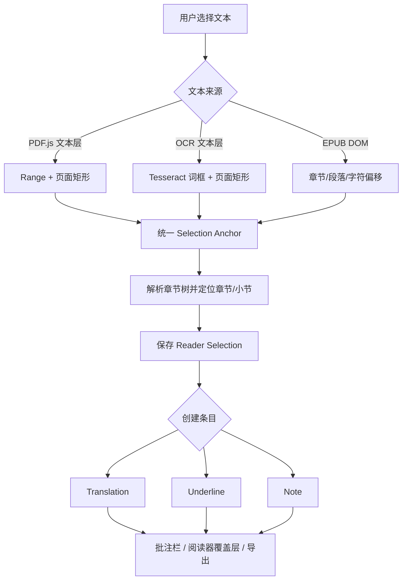

# PDF/EPUB 章节感知批注与导出方案

状态：已归档（2026-08-17；多级目录与性能约束修订版）

配套原子任务：`docs/archive/project-plans/2026-08-17-reader-annotation-chapter-export-atomic-tasks.md`

本版基于部分功能已经落地的前提，新增内容应采用增量方式接入，不以重做阅读器为前提，也不把增强功能的解析成本转嫁给原有阅读路径。

## 1. 目标

将阅读器中的选中文本统一建模为一个“选区”，并在选区上挂载三类独立条目：

1. 翻译：保存原文、目标语言和翻译结果。
2. 划线：保存原文位置，不要求附加文字。
3. 批注：保存原文位置和用户写下的笔记。

三类条目需要同时满足：

- 能准确记录所在章节、小节和页码。
- 在阅读器页面和右侧批注栏中有明确的类型差异。
- 可以单独编辑、删除、筛选和导出。
- 同一段原文可以同时拥有翻译、划线和批注。
- PDF、EPUB、原生文本层和 OCR 文本层使用同一套持久化模型。
- 重新解析目录或调整阅读器布局后，历史批注仍可定位或降级到可审核状态。

### 非回退约束

目录和批注属于增强功能，不能改变原有阅读路径的性能基线：

- 第一页的加载、显示、翻页、滚动和文本选择不等待目录分析。
- 目录分析不在 React renderer 中同步解析整个 PDF。
- 用户选择文本后先完成可见交互和原文保存，再异步补充章节路径；不能因为章节识别而阻塞右键菜单或批注编辑器。
- 目录缓存命中时直接使用旧结果，后台更新完成后再无感刷新，不显示空白目录。
- 目录树和批注栏只更新受影响的节点，不因一个条目变化而重绘整个阅读器。

## 2. 当前实现与缺口

当前 `books` 数据库的 `highlights` 表只有 `text`、`annotation` 和 JSON `anchor` 字段。翻译结果目前保存在 React 状态中，只有用户点击“用作批注”后才可能进入 `annotation`，因此无法区分翻译和普通批注。

PDF 原生文本选择目前通过 PDF.js 文本层的 `Range.getClientRects()` 产生归一化矩形；OCR 页面则通过 Tesseract 词框产生归一化矩形。这部分适合作为交互层，应继续保留。

当前导出逻辑还有两个问题：

- 所有导出条目都使用当前阅读章节，而不是每一条记录真实所在的章节。
- 导出只有“原文 + 批注”的概念，不能稳定表达翻译和划线。

相关代码位置：

- 选择与 PDF 坐标锚点：[src/views/Books.tsx](../../../src/views/Books.tsx:1666)
- 写入现有 `highlights`：[src/views/Books.tsx](../../../src/views/Books.tsx:2498)
- PDF/OCR 高亮覆盖层：[src/components/PdfOcrTextLayer.tsx](../../../src/components/PdfOcrTextLayer.tsx:257)
- 现有导出：[src/views/Books.tsx](../../../src/views/Books.tsx:2687)
- 数据库表结构：[electron/db/schema.ts](../../../electron/db/schema.ts:567)

## 3. 总体架构



核心原则：

- PDF.js/Tesseract 负责“用户看到的坐标和交互”。
- 章节服务负责“这段文字属于哪一个章节和小节”。
- 数据库负责“选区与三类条目的长期保存”。
- 导出服务只消费规范化数据，不直接读取 React 状态。
- `pdf-inspector` 只用于目录和文本结构分析，不替代 PDF.js 渲染和批注覆盖层。

## 4. 章节树设计

### 4.1 章节来源优先级

对 PDF 使用以下优先级：

1. PDF.js `PDFDocumentProxy.getOutline()`：PDF 自带书签，最可靠。
2. `pdf-inspector.extractStructureElements()` + `extractTextWithPositions()`：Tagged PDF 的任意深度结构，包括 H1-H6、TOC/TOCI 等角色。
3. `pdf-inspector.extractPagesMarkdownAsync()`：无书签、无结构标签时，根据字体大小、粗体、布局和标题模式推断多级标题。
4. 仅保存页码和“未识别章节”：不要为了生成漂亮标题而伪造低置信度章节。

这里不设置“两级目录”或固定最大深度。`level`、`parent_id` 和 `path` 必须支持任意深度；H1-H6 只是 PDF Tagged 结构的常见角色，不是产品层级上限。

EPUB 继续使用现有 EPUB TOC 和章节/段落偏移，不需要经过 PDF 章节解析流程。

### 4.2 章节缓存表

新增 `book_outline_nodes` 表，建议字段如下：

```sql
CREATE TABLE IF NOT EXISTS book_outline_nodes (
  id TEXT PRIMARY KEY,
  book_id INTEGER NOT NULL,
  parent_id TEXT,
  source TEXT NOT NULL CHECK(source IN ('pdf-outline', 'pdf-tagged', 'pdf-inferred', 'epub-toc')),
  level INTEGER NOT NULL,
  title TEXT NOT NULL,
  node_kind TEXT NOT NULL DEFAULT 'section',
  page_start INTEGER,
  y_start REAL,
  page_end INTEGER,
  y_end REAL,
  confidence REAL,
  sort_order INTEGER NOT NULL,
  path_key TEXT NOT NULL,
  locator_json TEXT NOT NULL,
  parser_version TEXT NOT NULL,
  content_hash TEXT NOT NULL,
  created_at TEXT DEFAULT CURRENT_TIMESTAMP,
  updated_at TEXT DEFAULT CURRENT_TIMESTAMP,
  FOREIGN KEY (book_id) REFERENCES books(id) ON DELETE CASCADE,
  FOREIGN KEY (parent_id) REFERENCES book_outline_nodes(id) ON DELETE CASCADE
);

CREATE INDEX IF NOT EXISTS book_outline_nodes_book_order_idx
  ON book_outline_nodes(book_id, sort_order);

CREATE INDEX IF NOT EXISTS book_outline_nodes_book_path_idx
  ON book_outline_nodes(book_id, path_key);
```

`locator_json` 保存来源特有的跳转信息：

- PDF.js outline：destination、page index、视图参数。
- Tagged PDF：page、MCID、PDF 点坐标。
- 推断标题：page、PDF 点坐标、标题文本匹配信息。
- EPUB TOC：chapter index、href、paragraph offset。

`path_key` 是稳定的文档内排序路径，例如 `0001/0003/0002`，不把路径编码成固定的 `chapter`/`section` 两列。`node_kind` 可用于区分 `chapter`、`section`、`subsection`、`appendix`、`toc` 等语义，但不能限制树的深度。

章节解析结果需要按文件内容哈希和解析器版本缓存。建议增加一次解析运行状态：

```sql
CREATE TABLE IF NOT EXISTS book_outline_runs (
  book_id INTEGER NOT NULL,
  content_hash TEXT NOT NULL,
  parser_version TEXT NOT NULL,
  status TEXT NOT NULL CHECK(status IN ('idle', 'running', 'ready', 'error')),
  progress REAL,
  error_message TEXT,
  started_at TEXT,
  completed_at TEXT,
  PRIMARY KEY (book_id, content_hash, parser_version),
  FOREIGN KEY (book_id) REFERENCES books(id) ON DELETE CASCADE
);
```

打开阅读器时先显示第一页和已有缓存；没有缓存时目录抽屉显示“正在分析目录”，但阅读器保持可用。解析完成后只刷新目录状态和树，不重新加载 PDF 文档。

### 4.3 多级树与章节路径

章节树在内存中同时保留两种索引：

- `childrenByParent`：用于递归渲染、展开和折叠。
- 按 `(page_start, y_start, sort_order)` 排序的扁平区间索引：用于批注定位，不逐条扫描所有节点。

每个节点的完整路径是一个数组，而不是只有“章节标题”和“小节标题”：

```ts
type OutlinePathNode = {
  id: string
  title: string
  level: number
  source: 'pdf-outline' | 'pdf-tagged' | 'pdf-inferred' | 'epub-toc'
}

type OutlinePathSnapshot = {
  nodes: OutlinePathNode[]
  confidence: number
  resolvedBy: 'native-outline' | 'tagged-structure' | 'inferred-heading' | 'page-only'
}
```

批注、导出和深链接都保存完整 `OutlinePathSnapshot.nodes`。展示时可将前两级简称为章节/小节，但不能丢弃第三级及更深层级。

### 4.4 多级目录的友好交互

目录抽屉应使用递归树，而不是固定的两列或两级列表：

- 每个可展开节点都有独立展开/折叠状态，状态按书籍保存。
- 当前阅读位置自动展开其祖先路径，并高亮当前最深节点。
- 点击任意节点跳转到该节点的起始页和起始位置。
- 提供“展开到当前章节”和“全部折叠”，不默认展开数百个后代节点。
- 深度超过常见层级时仍保留完整数据；视觉上使用树连接线和紧凑缩进，避免侧栏宽度无限增长。
- 目录节点超过可接受数量时使用虚拟列表或按展开分支懒渲染，不能一次性创建几千个按钮。

目录分析期间显示非阻塞状态条：`正在分析目录`、`已完成部分目录`、`目录分析失败，可重试`。状态条提供重试，但不遮挡阅读区域；旧缓存存在时继续显示旧目录并标记“正在更新”。

### 4.5 章节定位算法

对一个选区，统一得到文档位置 `DocumentPosition`：

```ts
type DocumentPosition = {
  format: 'pdf' | 'epub'
  pageNumber?: number
  y?: number
  chapterIndex?: number
  blockOffset?: number
  charOffset?: number
  outlineNodeId?: string
  outlinePath?: OutlinePathSnapshot
}
```

PDF 定位使用 `(pageNumber, y)`，在预先构建的扁平区间索引中选择拥有最大 `page_start/y_start` 且不晚于选区起点的节点；同一位置优先选择最深层级节点。EPUB 使用现有 `(chapterIndex, blockOffset)` 精确匹配，并沿 EPUB TOC 父链构建完整路径。

最终保存两份信息：

1. `outline_node_id`：便于未来重新解析目录后修正关联。
2. `outline_snapshot`：保存创建批注时的完整路径，保证导出不会因目录变化而失去上下文。

用户选择时先保存 `anchor`、原文和页码，章节路径在内存索引命中时立即写入；索引尚未就绪时先写入 `location_status = 'pending'`，后台完成后更新路径。批注栏显示“章节识别中”，不阻塞用户继续编辑。

如果选区跨越多个章节，使用起始节点作为主节点，同时记录 `end_outline_snapshot`；导出时标记“跨章节”，不强行拆分原文。

## 5. 统一数据模型

建议新增“选区”和“条目”两层，而不是继续把三种含义塞进 `highlights.annotation`。

### 5.1 `reader_selections`

一个选区代表一段原文和它在文档中的位置。

```sql
CREATE TABLE IF NOT EXISTS reader_selections (
  id TEXT PRIMARY KEY,
  book_id INTEGER NOT NULL,
  source_text TEXT NOT NULL,
  format TEXT NOT NULL CHECK(format IN ('pdf', 'epub')),
  anchor_version INTEGER NOT NULL DEFAULT 2,
  anchor_json TEXT NOT NULL,
  locator_json TEXT NOT NULL,
  location_status TEXT NOT NULL DEFAULT 'pending'
    CHECK(location_status IN ('pending', 'resolved', 'page-only', 'error')),
  outline_node_id TEXT,
  outline_snapshot_json TEXT NOT NULL,
  end_outline_snapshot_json TEXT,
  source_hash TEXT,
  created_at TEXT DEFAULT CURRENT_TIMESTAMP,
  updated_at TEXT DEFAULT CURRENT_TIMESTAMP,
  FOREIGN KEY (book_id) REFERENCES books(id) ON DELETE CASCADE,
  FOREIGN KEY (outline_node_id) REFERENCES book_outline_nodes(id) ON DELETE SET NULL
);

CREATE INDEX IF NOT EXISTS reader_selections_book_order_idx
  ON reader_selections(book_id, created_at);

CREATE INDEX IF NOT EXISTS reader_selections_book_location_idx
  ON reader_selections(book_id, location_status, outline_node_id);
```

### 5.2 `reader_annotation_items`

一个选区可挂多个条目，例如同一段原文同时有划线、中文翻译和个人批注。

```sql
CREATE TABLE IF NOT EXISTS reader_annotation_items (
  id TEXT PRIMARY KEY,
  selection_id TEXT NOT NULL,
  kind TEXT NOT NULL CHECK(kind IN ('translation', 'underline', 'note')),
  body TEXT,
  target_language TEXT,
  style_token TEXT,
  created_at TEXT DEFAULT CURRENT_TIMESTAMP,
  updated_at TEXT DEFAULT CURRENT_TIMESTAMP,
  FOREIGN KEY (selection_id) REFERENCES reader_selections(id) ON DELETE CASCADE
);

CREATE INDEX IF NOT EXISTS reader_annotation_items_selection_kind_idx
  ON reader_annotation_items(selection_id, kind);
```

约束建议：

- `underline` 的 `body` 为空。
- `translation` 的 `body` 必填，`target_language` 必填。
- `note` 的 `body` 必填，`target_language` 为空。
- 同一个 `selection_id` 可以有多个 `note`，但默认只允许一个当前语言的 `translation`。
- `style_token` 只存语义值，例如 `translation`、`underline`、`note`，不直接存颜色值。

### 5.3 Anchor v2

现有 PDF anchor 只保存一个 `pageNumber` 和 `areas`，跨页选择会丢失后续页面。建议升级为：

```ts
type ReaderAnchorV2 = {
  version: 2
  format: 'pdf' | 'epub'
  pdf?: {
    segments: Array<{
      pageNumber: number
      areas: Array<{ x: number; y: number; width: number; height: number }>
      pdfPoints?: Array<[number, number, number, number]>
    }>
    start?: { pageNumber: number; x: number; y: number }
    end?: { pageNumber: number; x: number; y: number }
  }
  epub?: {
    chapterIndex: number
    blockOffset: number
    startOffset: number
    endOffset: number
  }
  quote: {
    exact: string
    prefix?: string
    suffix?: string
  }
}
```

`pdfPoints` 是可选冗余定位信息，用于窗口尺寸变化或文本层变化后的重定位；当前显示仍以归一化 DOM 矩形为准。

### 5.4 章节解析与阅读性能

章节增强必须遵循“缓存优先、后台分析、增量更新”：

- PDF 文档加载成功后先调用 PDF.js 的原生 `getOutline()`；该结果作为首选目录，不等待 `pdf-inspector`。
- 只有原生目录为空或用户主动刷新时，才启动 `pdf-inspector` fallback。
- `extractPagesMarkdownAsync()` 放在 Electron Worker/线程池；同步的结构和坐标 API 放在专用 Worker Thread，不在 renderer 或主进程直接运行。
- 一个书籍同一时间只允许一个目录分析任务；新任务取消旧任务或复用其 Promise，避免重复解析。
- 分析结果按文件内容哈希、解析器版本和 PDF 页数缓存；缓存命中直接复用，文件未变化不重新解析。
- 新增批注不触发全书重新解析，只对当前内存目录索引做 O(log n) 定位。
- 目录刷新只更新目录树和批注位置状态，不重建 `<Document>`、不重置滚动位置、不重新渲染已显示页面。

建议把以下指标作为实现门槛，而不是上线后再观察：

| 场景 | 目标 |
|---|---|
| 已有缓存打开阅读器 | 不增加第一页可见时间 |
| 无缓存打开阅读器 | 目录分析不阻塞第一页和文本选择 |
| 缓存已就绪时保存选区 | 章节定位不阻塞编辑器，目标为一次事件循环内完成 |
| 大 PDF 后台分析 | 不阻塞滚动、翻页和窗口拖动 |
| 目录树展开 | 只渲染当前展开分支，不能一次性渲染全部深层节点 |

出现异常时保留页面级定位，`location_status` 设为 `page-only` 或 `error`，让用户可以继续使用和导出，不把失败转换成空白或不可编辑状态。

## 6. 三类批注交互与视觉设计

### 6.1 创建流程

用户选择文本后，右侧编辑区显示三个明确动作：

- 翻译：调用现有翻译服务，结果作为 `translation` 条目保存。
- 划线：立即保存 `underline` 条目，不要求用户输入文字。
- 批注：打开文本输入框，保存 `note` 条目。

翻译结果不再自动塞入批注文本。可以提供“复制到批注”作为显式动作，但它会创建一个独立的 `note`，并保留原始翻译条目。

同一选区的三个条目应独立编辑和删除，不能通过 `highlighted = false` 推断类型。

### 6.2 颜色和样式

颜色不能是唯一的区分方式，需同时使用图标、文字标签、边框和布局。

建议语义 token：

| 类型 | 图标建议 | 浅色主题 | 深色主题 | 阅读器覆盖层 |
|---|---|---|---|---|
| 翻译 | Languages | 蓝色文字/浅蓝背景 | 亮蓝/深蓝背景 | 翻译结果不覆盖原文，显示在批注栏 |
| 划线 | Underline | 琥珀色底线 | 亮琥珀色底线 | 原文矩形仅显示底线 |
| 批注 | MessageSquare | 绿色左边框/浅绿背景 | 亮绿色左边框 | 原文矩形显示淡色填充和批注标记 |

建议批注栏使用分段筛选：`全部`、`翻译`、`划线`、`批注`，每个标签显示数量。默认按文档顺序排序，辅助按创建时间排序。

每个条目至少显示：类型标签、原文、章节/小节、页码、正文内容、创建时间和操作按钮。批注栏中的类型卡片点击后跳转到对应选区；跨页选区滚动到第一段。

## 7. 导出设计

### 7.1 统一导出模型

先由数据库生成与 UI 无关的导出模型：

```ts
type ExportAnnotationRecord = {
  id: string
  kind: 'translation' | 'underline' | 'note'
  sourceText: string
  body?: string
  targetLanguage?: string
  chapterPath: string[]
  pageNumber?: number
  documentOrder: number
  deepLink: string
}
```

排序顺序：章节层级 -> 页码/EPUB 段落 -> 页面 y 坐标 -> 创建时间。

章节或页码无法识别时，归入“未识别章节”，并保留页码，不丢弃条目。

`chapterPath` 是完整路径数组，不允许在导出模型中降级成固定的 `chapter` 和 `section` 两个字段。导出分组按完整路径进行；同一父节点下的不同深层节点必须保持原目录顺序。

### 7.2 Markdown 导出格式

建议输出如下：

```markdown
# 书名

## 第一章 章节标题

### 1.1 小节标题

#### 翻译

> Original text

翻译：翻译结果

来源：第 12 页 · 第一章 / 1.1 小节

#### 划线

> Important sentence

来源：第 13 页 · 第一章 / 1.1 小节

#### 批注

> Another sentence

批注：我的理解和问题

来源：第 14 页 · 第一章 / 1.1 小节
```

Markdown 不依赖颜色表达类型，使用标题和文字标签；HTML、DOCX 和 PDF 导出可以在此基础上增加颜色和图标。

Markdown 的标准标题通常只支持 H1-H6，但源目录不能因此截断。建议：

- 书名使用 H1，前五级目录使用 H2-H6。
- 第六级之后使用带完整路径的加粗路径行和嵌套列表，保留 `data-outline-depth` 或等价元信息。
- HTML/DOCX/PDF 使用真实的任意深度层级，不受 Markdown 标题限制。
- 每条记录始终附带完整面包屑，例如“第一章 / 1.2 / 1.2.3 / 1.2.3.1”。

### 7.3 增量同步

当前导出会按标题覆盖整篇 Note，并且使用当前章节。建议改成：

- 由数据库完整重建“生成区域”，保证删除和编辑都能反映到导出文档。
- 在 Note 中使用不可见标记保存生成区域边界，例如 `lifeos:reader-annotations`。
- 不修改生成区域之外的用户手写内容。
- 每个条目带稳定 ID，重复导出不会产生重复条目。

第一阶段建议只实现 Markdown/Notes 导出，复用现有 Notes 模块；第二阶段再增加独立 `.md`、`.html`、`.docx` 和 `.pdf` 文件导出。

导出生成应在后台执行。用户点击导出后立即显示“正在整理批注”，批注栏和阅读器继续可用；导出失败保留重试入口，并显示失败原因，不清空已有 Note。

## 8. 迁移策略

采用增量迁移，不立即删除现有 `highlights` 表。

### 8.1 旧数据映射

每一条旧 `highlights` 先创建一个 `reader_selections`：

- `source_text` <- `highlights.text`
- `anchor_json` <- 旧 `anchor`，转换为 Anchor v2
- `outline_snapshot_json` <- 根据页码/章节重新解析，失败时写入“未识别章节”

再按旧数据拆分条目：

- `anchor.highlighted !== false` -> `underline`
- 非空 `annotation` -> `note`
- 无法判断是否原本是翻译的旧 annotation，默认迁移为 `note`，不猜测其类型。

迁移完成后保留旧表一段时间，采用双读或只读兼容，确认数据量一致后再移除旧代码路径。

### 8.2 兼容旧链接

当前 `book:{id}#chapter` 深链接继续可用；新增 `book:{id}#annotation:{annotationId}`。如果旧链接只有章节名，则打开章节首个可定位节点。

## 9. 代码落点

建议拆出服务和组件，避免继续扩大 `Books.tsx`：

```text
src/types/readerAnnotation.ts
src/services/readerAnnotationSerializer.ts
src/components/ReaderAnnotationsPanel.tsx
src/components/PdfAnnotationLayer.tsx
src/components/ReaderSelectionEditor.tsx
electron/readerOutlineService.ts
electron/readerAnnotationMigration.ts
electron/worker/pdfInspectorWorker.ts
```

主要职责：

- `readerAnnotation.ts`：共享类型、Anchor v2、三类条目。
- `readerOutlineService.ts`：PDF.js outline、pdf-inspector fallback、章节缓存。
- `pdfInspectorWorker.ts`：执行同步的结构/位置 API，避免阻塞 Electron 主进程。
- `PdfAnnotationLayer.tsx`：只负责 PDF/OCR 归一化矩形的显示，不负责数据库。
- `ReaderAnnotationsPanel.tsx`：筛选、编辑、删除、跳转和导出入口。
- `readerAnnotationSerializer.ts`：Markdown/HTML/DOCX/PDF 的公共排序和分组逻辑。
- `Books.tsx`：只保留阅读器生命周期和回调编排。

`pdf-inspector` 不应直接打进 React renderer。Node N-API 版本应放在 Electron 主进程或 Worker 中，通过窄 IPC 接口返回章节结果和定位数据。

### 9.1 性能与状态实现要求

章节解析服务需要暴露明确状态，而不是让 UI 通过“目录是否为空”猜测状态：

```ts
type OutlineAnalysisState =
  | { status: 'idle'; cached: boolean }
  | { status: 'running'; cached: boolean; progress?: number; cancel: () => void }
  | { status: 'ready'; cached: boolean; nodeCount: number; updatedAt: string }
  | { status: 'error'; cached: boolean; message: string; retry: () => void }
```

实现上需要遵循以下边界：

- `Document` 和已渲染页面组件不订阅完整目录树，只订阅当前页和当前路径。
- 目录抽屉使用递归的 memoized 节点组件；批注栏按章节路径分组，并对大量条目使用虚拟列表。
- 解析进度只更新状态条，不能让每个页面解析进度触发阅读器整体 React render。
- 选择文本、打开上下文菜单、保存划线应优先于低优先级目录更新。
- 用户关闭阅读器或切换书籍时取消目录任务，避免旧任务回写新书的章节状态。
- 章节识别失败不回滚已保存的条目；后台只能把 `pending` 更新为 `resolved`、`page-only` 或 `error`。

## 10. 分阶段实施

### Phase 1：数据模型和迁移

- 新增两张表和索引。
- 定义共享 TypeScript 类型。
- 实现旧 `highlights` 到新模型的幂等迁移。
- 实现统一查询和保存 API。
- 添加迁移数量、空字段和旧 anchor 兼容测试。

### Phase 2：章节定位

- PDF.js 加载成功后读取原生 outline。
- 无 outline 时后台运行 `pdf-inspector`。
- 保存任意深度章节树、父子关系、完整路径、缓存版本和运行状态。
- 建立按页码和 y 坐标的定位索引，避免保存每条批注时扫描整棵树。
- 给每个新选区写入章节/小节快照。
- 对无法定位的条目标记 `confidence` 和“未识别章节”。
- 目录更新期间继续显示旧缓存或页码目录，不阻塞阅读。

### Phase 3：三类交互

- 把翻译从临时 React 状态变成独立条目。
- 增加“翻译 / 划线 / 批注”三个创建动作。
- 将当前 PDF/OCR 覆盖层改为读取 `reader_annotation_items`。
- 批注栏增加类型筛选、数量、颜色、图标和跳转。
- 保存跨页 Anchor v2。

### Phase 4：导出

- 先实现章节分组的 Markdown/Notes 导出。
- 修复每条记录使用自身章节，而不是当前章节。
- 加入稳定 ID、深链接、类型标签和页码。
- 再复用公共导出模型实现 HTML/DOCX/PDF。

### Phase 5：质量和性能

- 建立普通文本、多栏、扫描、混合、无目录和损坏容错 PDF 样本集。
- 建立三级、五级和更深目录样本，验证父子关系、展开状态、当前路径和导出层级。
- 验证章节定位、跨页选择、缩放重绘、OCR 选择和导出顺序。
- 首屏不等待目录解析。
- 对缓存命中、缓存未命中、解析失败、取消解析和大批注列表分别做交互性能测试。
- 用性能记录确认目录能力不会增加第一页可见时间、文本选择延迟和滚动卡顿。
- 结构/坐标解析放 Worker，主线程不被大 PDF 阻塞。

## 11. 验收标准

- 同一选区可以同时拥有翻译、划线和批注，彼此独立编辑和删除。
- 批注栏可以只查看一种类型，并且不依赖颜色才能识别类型。
- 每条导出记录包含原文、类型正文、章节路径、页码和深链接。
- 原生 PDF 书签跳转优先使用 PDF.js，不被启发式标题覆盖。
- PDF/EPUB 目录支持任意深度，目录树、批注路径和导出路径不丢失第三级及更深节点。
- 没有目录的 PDF 不产生虚假章节，至少保留页码和“未识别章节”。
- PDF 缩放、布局切换和重新打开后，已保存矩形仍能正确显示。
- OCR 页面与原生文本页面共用相同的批注栏和导出格式。
- 重复导出不会重复添加条目，删除条目会从生成区域消失。
- 迁移前后的条目数量可核对，旧数据不因无法识别类型而丢失。
- 大 PDF 的章节分析不阻塞第一页渲染、用户选择、翻页、滚动和窗口调整。
- 目录分析中的加载、部分完成、失败和重试状态可理解、可操作，并且不会遮挡阅读内容。

## 12. 需要审核的决策

1. 是否采用“选区 + 条目”两层模型，而不是在现有 `highlights` 表增加 `kind` 字段？推荐两层模型，因为同一段原文同时拥有三类条目时不会重复保存位置。
2. 翻译是否默认自动创建划线？推荐不自动创建，翻译、划线和批注保持独立，由用户明确选择。
3. 是否允许用户自定义三类颜色？第一阶段推荐固定语义颜色，后续再支持主题级调整。
4. 第一阶段导出是否只做 Notes Markdown？推荐是，先保证章节分组和数据正确，再增加 DOCX/PDF 样式导出。
5. 是否允许用户手动修正“未识别章节”？推荐增加“修改章节归属”入口，修正结果写入快照，不修改 PDF 原文。
6. Markdown 中第六级之后的目录是否接受“完整路径 + 嵌套列表”的表现形式？推荐接受，以避免为了 Markdown 标题限制而截断真实目录。
